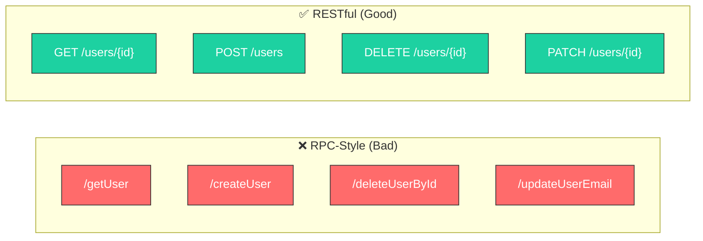
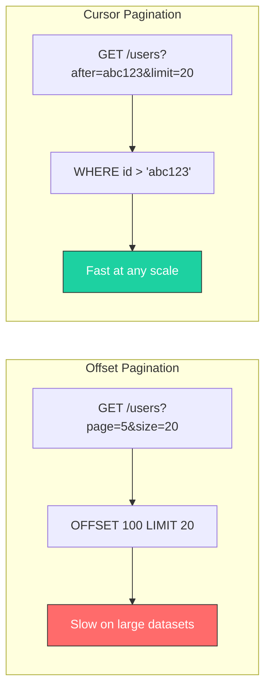
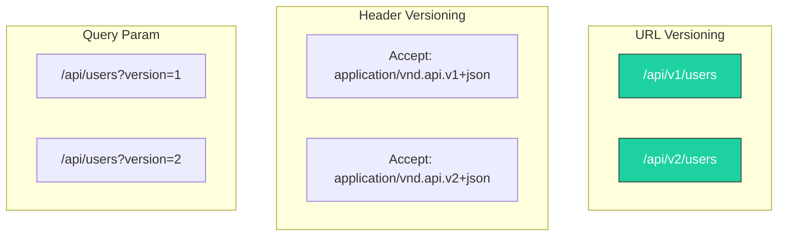
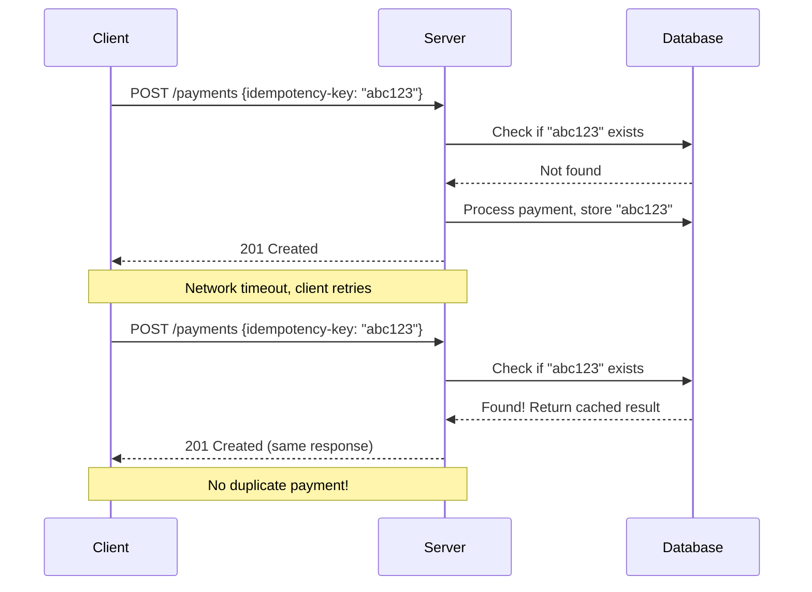
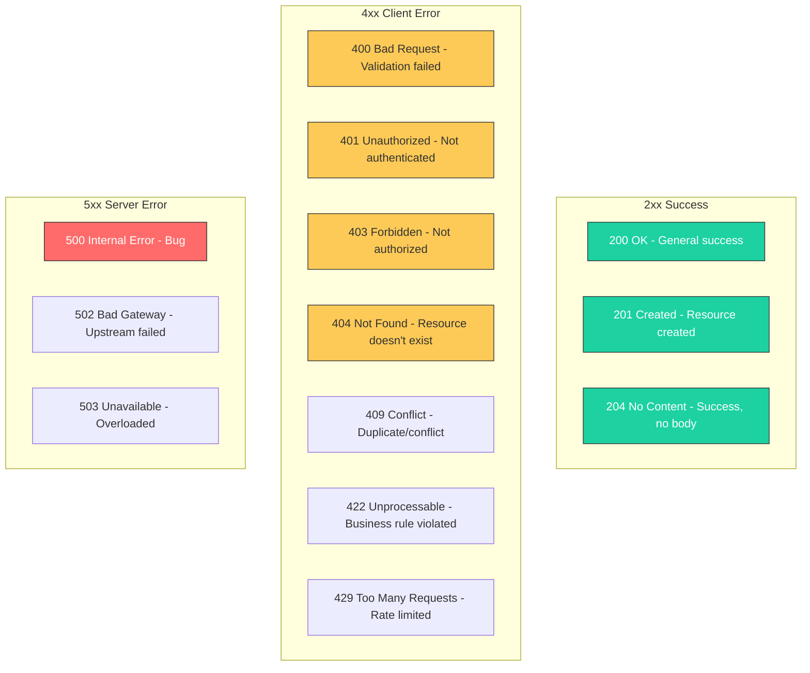

## API Design: Building APIs That Don't Suck

A well-designed API is a contract between you and your consumers. Get it wrong, and you'll spend years maintaining backward compatibility for bad decisions. Get it right, and your API becomes a joy to use.

---

### 1. REST: Resources, Not Actions



**The Rules:**
- URLs identify **resources** (nouns), not actions (verbs)
- HTTP methods define the **action**
- Use plural nouns: `/users`, not `/user`

| HTTP Method | Purpose | Idempotent? |
|-------------|---------|-------------|
| GET | Read a resource | Yes |
| POST | Create a resource | No |
| PUT | Replace a resource entirely | Yes |
| PATCH | Partial update | Yes |
| DELETE | Remove a resource | Yes |

**Exception: Actions That Aren't CRUD**

Sometimes you need verbs. Use a sub-resource:
```
POST /orders/{id}/cancel      # Action on resource
POST /users/{id}/send-verification-email
POST /payments/{id}/refund
```

---

### 2. Consistent Response Structure

Every response should have the same shape. Clients shouldn't guess.

```java
// Standard response wrapper
public record ApiResponse<T>(
    T data,
    String message,
    Instant timestamp,
    String requestId
) {
    public static <T> ApiResponse<T> success(T data) {
        return new ApiResponse<>(data, null, Instant.now(), MDC.get("requestId"));
    }

    public static <T> ApiResponse<T> error(String message) {
        return new ApiResponse<>(null, message, Instant.now(), MDC.get("requestId"));
    }
}
```

**Success Response:**
```json
{
    "data": {
        "id": "123",
        "email": "user@example.com",
        "name": "John Doe"
    },
    "message": null,
    "timestamp": "2024-01-15T10:30:00Z",
    "requestId": "req-abc-123"
}
```

**Error Response:**
```json
{
    "data": null,
    "message": "User not found",
    "timestamp": "2024-01-15T10:30:00Z",
    "requestId": "req-abc-123",
    "errors": [
        {
            "field": "email",
            "code": "INVALID_FORMAT",
            "message": "Email must be a valid email address"
        }
    ]
}
```

**Spring Boot Exception Handler:**
```java
@RestControllerAdvice
public class GlobalExceptionHandler {

    @ExceptionHandler(EntityNotFoundException.class)
    public ResponseEntity<ApiResponse<Void>> handleNotFound(EntityNotFoundException ex) {
        return ResponseEntity
            .status(HttpStatus.NOT_FOUND)
            .body(ApiResponse.error(ex.getMessage()));
    }

    @ExceptionHandler(MethodArgumentNotValidException.class)
    public ResponseEntity<ApiResponse<Void>> handleValidation(MethodArgumentNotValidException ex) {
        List<FieldError> errors = ex.getBindingResult().getFieldErrors().stream()
            .map(e -> new FieldError(e.getField(), "INVALID", e.getDefaultMessage()))
            .toList();

        return ResponseEntity
            .status(HttpStatus.BAD_REQUEST)
            .body(new ApiResponse<>(null, "Validation failed", Instant.now(),
                MDC.get("requestId"), errors));
    }
}
```

---

### 3. Pagination: Don't Return 10,000 Records



**Offset Pagination (Simple, but slow at scale):**
```java
@GetMapping("/users")
public Page<UserDto> getUsers(
    @RequestParam(defaultValue = "0") int page,
    @RequestParam(defaultValue = "20") int size
) {
    return userRepository.findAll(PageRequest.of(page, size))
        .map(this::toDto);
}
```
```json
{
    "data": [...],
    "page": 5,
    "size": 20,
    "totalElements": 1000,
    "totalPages": 50
}
```

**Cursor Pagination (Scalable):**
```java
@GetMapping("/users")
public CursorPage<UserDto> getUsers(
    @RequestParam(required = false) String cursor,
    @RequestParam(defaultValue = "20") int limit
) {
    List<User> users = cursor == null
        ? userRepository.findTopByOrderByIdAsc(limit + 1)
        : userRepository.findByIdGreaterThanOrderByIdAsc(decode(cursor), limit + 1);

    boolean hasMore = users.size() > limit;
    if (hasMore) users = users.subList(0, limit);

    String nextCursor = hasMore ? encode(users.get(users.size() - 1).getId()) : null;

    return new CursorPage<>(
        users.stream().map(this::toDto).toList(),
        nextCursor,
        hasMore
    );
}
```
```json
{
    "data": [...],
    "nextCursor": "eyJpZCI6MTIzfQ==",
    "hasMore": true
}
```

> **Rule of Thumb:** Use offset for admin UIs with "jump to page" feature. Use cursor for infinite scroll, mobile apps, or large datasets.

---

### 4. Filtering, Sorting, and Field Selection

**Filtering:**
```
GET /orders?status=PENDING&created_after=2024-01-01
GET /products?category=electronics&price_min=100&price_max=500
```

**Sorting:**
```
GET /users?sort=created_at:desc
GET /products?sort=price:asc,name:desc
```

**Field Selection (Sparse Fieldsets):**
```
GET /users/123?fields=id,name,email
```

```java
@GetMapping("/orders")
public List<OrderDto> getOrders(
    @RequestParam(required = false) OrderStatus status,
    @RequestParam(required = false) @DateTimeFormat(iso = ISO.DATE) LocalDate createdAfter,
    @RequestParam(defaultValue = "created_at:desc") String sort
) {
    Specification<Order> spec = Specification.where(null);

    if (status != null) {
        spec = spec.and((root, query, cb) -> cb.equal(root.get("status"), status));
    }
    if (createdAfter != null) {
        spec = spec.and((root, query, cb) ->
            cb.greaterThanOrEqualTo(root.get("createdAt"), createdAfter.atStartOfDay()));
    }

    Sort sortOrder = parseSort(sort);  // "created_at:desc" -> Sort object
    return orderRepository.findAll(spec, sortOrder).stream()
        .map(this::toDto)
        .toList();
}
```

---

### 5. Versioning Strategy



**URL Versioning (Recommended for Public APIs):**
```java
@RestController
@RequestMapping("/api/v1/users")
public class UserControllerV1 {
    @GetMapping("/{id}")
    public UserDtoV1 getUser(@PathVariable Long id) { ... }
}

@RestController
@RequestMapping("/api/v2/users")
public class UserControllerV2 {
    @GetMapping("/{id}")
    public UserDtoV2 getUser(@PathVariable Long id) { ... }
}
```

**Evolution Without Breaking Changes:**
- Adding fields is safe
- Adding new endpoints is safe
- Removing fields requires a new version
- Changing field types requires a new version

---

### 6. Idempotency: Safe Retries

Network failures happen. Clients will retry. Make sure retries don't create duplicates.



```java
@PostMapping("/payments")
public ResponseEntity<PaymentResponse> createPayment(
    @RequestHeader("Idempotency-Key") String idempotencyKey,
    @RequestBody PaymentRequest request
) {
    // Check for existing request
    Optional<IdempotencyRecord> existing = idempotencyRepository.findByKey(idempotencyKey);
    if (existing.isPresent()) {
        return ResponseEntity
            .status(existing.get().getStatusCode())
            .body(existing.get().getResponse());
    }

    // Process new request
    PaymentResponse response = paymentService.process(request);

    // Store for future retries
    idempotencyRepository.save(new IdempotencyRecord(
        idempotencyKey,
        HttpStatus.CREATED.value(),
        response,
        Instant.now().plus(24, ChronoUnit.HOURS)  // TTL
    ));

    return ResponseEntity.status(HttpStatus.CREATED).body(response);
}
```

---

### 7. Rate Limiting

Protect your API from abuse:

```java
@Component
public class RateLimitFilter extends OncePerRequestFilter {

    private final RateLimiter rateLimiter;  // Redis-backed

    @Override
    protected void doFilterInternal(HttpServletRequest request,
            HttpServletResponse response, FilterChain chain) throws ServletException, IOException {

        String clientId = extractClientId(request);  // API key or IP
        String endpoint = request.getMethod() + ":" + request.getRequestURI();

        RateLimitResult result = rateLimiter.tryAcquire(clientId, endpoint);

        // Add rate limit headers
        response.setHeader("X-RateLimit-Limit", String.valueOf(result.getLimit()));
        response.setHeader("X-RateLimit-Remaining", String.valueOf(result.getRemaining()));
        response.setHeader("X-RateLimit-Reset", String.valueOf(result.getResetAt()));

        if (!result.isAllowed()) {
            response.setStatus(HttpStatus.TOO_MANY_REQUESTS.value());
            response.getWriter().write("{\"message\": \"Rate limit exceeded\"}");
            return;
        }

        chain.doFilter(request, response);
    }
}
```

**Response Headers:**
```
HTTP/1.1 200 OK
X-RateLimit-Limit: 100
X-RateLimit-Remaining: 95
X-RateLimit-Reset: 1705320000
```

---

### 8. HTTP Status Codes: Use Them Correctly



| Status | When to Use |
|--------|-------------|
| **200** | GET success, PUT/PATCH success with body |
| **201** | POST created resource (include Location header) |
| **204** | DELETE success, PUT/PATCH success without body |
| **400** | Malformed request, validation errors |
| **401** | Missing or invalid authentication |
| **403** | Authenticated but not authorized |
| **404** | Resource not found |
| **409** | Conflict (duplicate email, version mismatch) |
| **422** | Business rule violation (insufficient funds) |
| **429** | Rate limit exceeded |
| **500** | Unexpected server error (bug) |
| **503** | Service temporarily unavailable |

---

### 9. OpenAPI Documentation

Document your API automatically:

```java
@Operation(summary = "Get user by ID", description = "Returns a single user")
@ApiResponses({
    @ApiResponse(responseCode = "200", description = "User found"),
    @ApiResponse(responseCode = "404", description = "User not found")
})
@GetMapping("/users/{id}")
public UserDto getUser(
    @Parameter(description = "User ID", required = true)
    @PathVariable Long id
) {
    return userService.findById(id)
        .map(this::toDto)
        .orElseThrow(() -> new EntityNotFoundException("User not found"));
}
```

**Springdoc Configuration:**
```yaml
springdoc:
  api-docs:
    path: /api-docs
  swagger-ui:
    path: /swagger-ui.html
    operationsSorter: method
```

---

### Quick Reference

| Aspect | Best Practice |
|--------|---------------|
| **URLs** | Nouns, plural, lowercase, hyphens |
| **Methods** | GET=read, POST=create, PUT=replace, PATCH=update, DELETE=remove |
| **Status Codes** | Use semantically correct codes |
| **Responses** | Consistent envelope structure |
| **Pagination** | Cursor for scale, offset for simplicity |
| **Versioning** | URL prefix for public APIs |
| **Idempotency** | Required for POST/PATCH mutations |
| **Rate Limiting** | Always, with informative headers |

---

[Prev: Database Patterns](./Database_Patterns.md) | [Back to Index](../../README.md)


---
## License
This repository is open-source under the [MIT License](/LICENSE.md).
