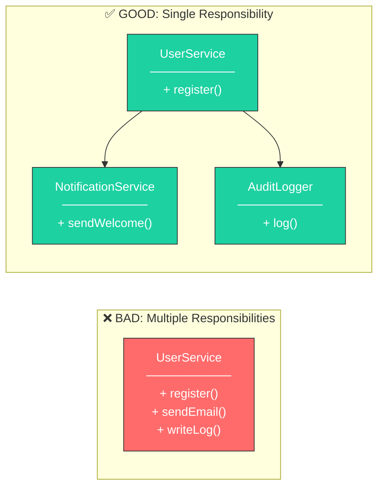
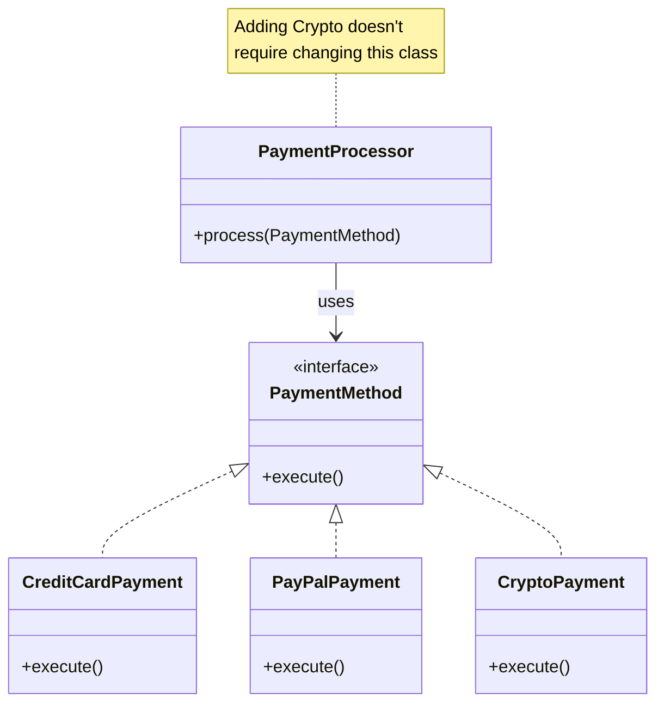
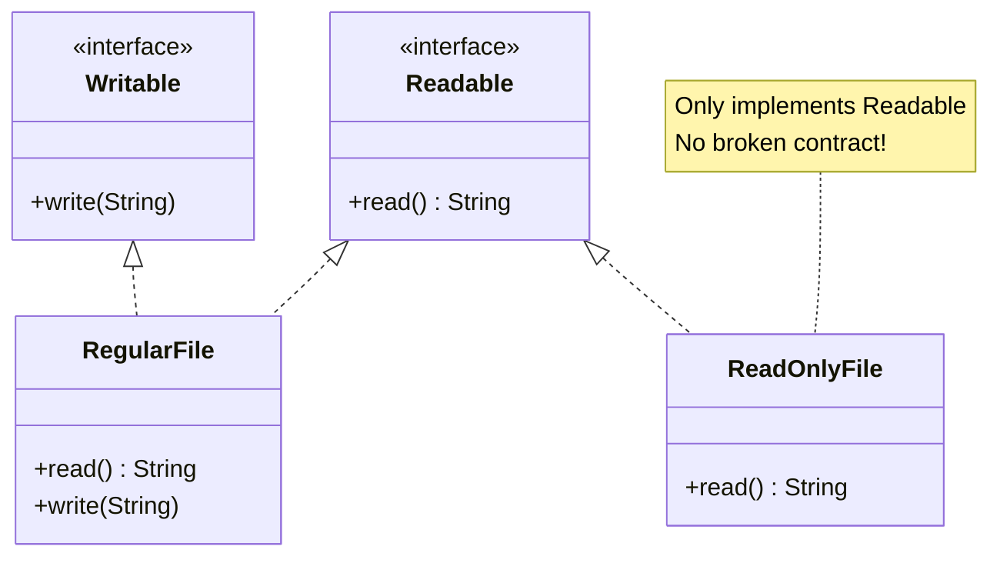
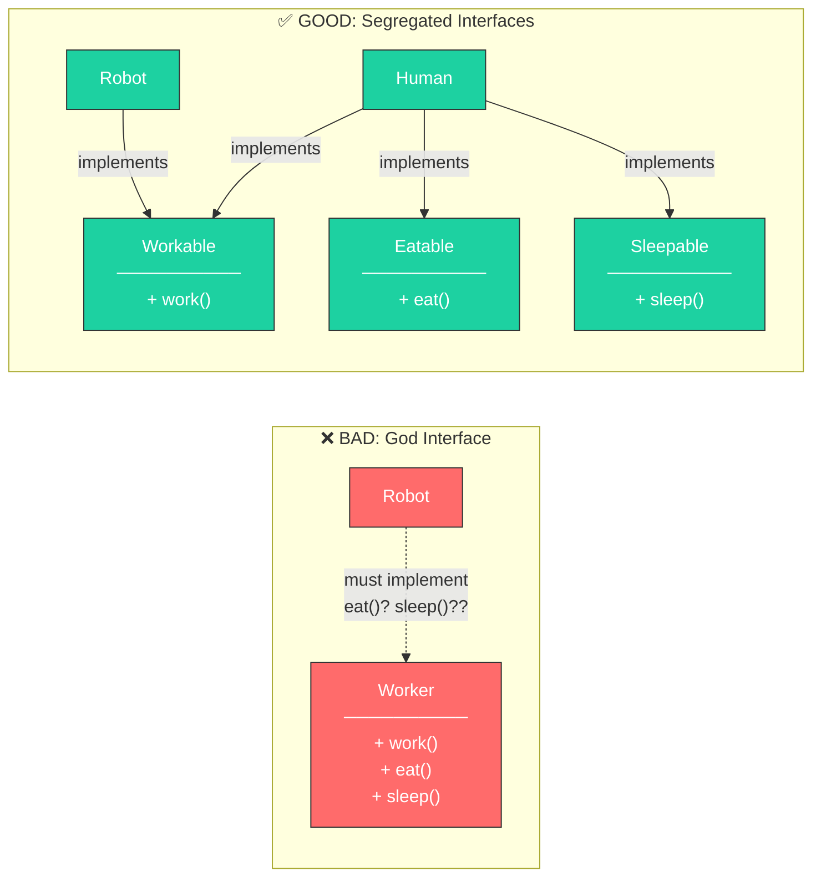
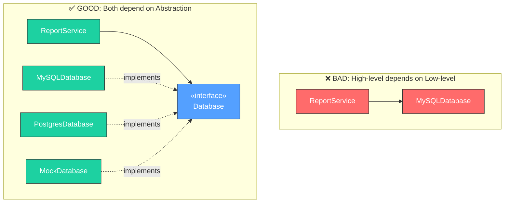

## Clean Code: Design Principles (SOLID)

The idea behind "Clean Code" is wonderfully expressed in Robert C. Martin's book *Clean Code: A Handbook of Agile Software Craftsmanship*. However, definitions alone are often dry. Let's look at **SOLID** principles with a practical mindset, using Java examples to illustrate the difference between "working code" and "maintainable code".

---

### 1. Single Responsibility Principle (SRP)
> "A class should have one, and only one, reason to change."



**The Violation:**
Imagine a `UserService` that handles registration, sends welcome emails, and logs activities to a file.
```java
// BAD: Too many responsibilities
public class UserService {
    public void register(User user) {
        // 1. Save to DB
        database.save(user);
        // 2. Send Email
        emailClient.send("Welcome", user.getEmail());
        // 3. Format and Log
        String log = "User registered: " + user.getId();
        fileSystem.write("audit.log", log);
    }
}
```
If the email provider changes, this class changes. If the logging format changes, this class changes.

**The Fix:**
Delegate.
```java
// GOOD: Orchestration only
public class UserService {
    private final UserRepository repository;
    private final EmailNotificationService notificationService;
    private final AuditLogger auditLogger;

    public void register(User user) {
        repository.save(user);
        notificationService.sendWelcomeEmail(user);
        auditLogger.logRegistration(user);
    }
}
```

> **How to Spot SRP Violations:** If you describe your class and use "AND" multiple times ("This class handles users AND sends emails AND logs events"), it's doing too much.

---

### 2. Open-Closed Principle (OCP)
> "Software entities should be open for extension, but closed for modification."



**The Violation:**
Using `switch` statements or `if-else` chains to handle different types.
```java
// BAD: Modifying existing code to add a new payment method
public void processPayment(Payment payment) {
    if (payment.getType() == CREDIT_CARD) {
        // process card
    } else if (payment.getType() == PAYPAL) {
        // process paypal
    }
    // Adding CRYPTO requires changing this class!
}
```

**The Fix:**
Use Polymorphism.
```java
// GOOD: New payment types can be added without touching this class
public interface PaymentMethod {
    void execute(BigDecimal amount);
}

public class CreditCardPayment implements PaymentMethod {
    @Override
    public void execute(BigDecimal amount) {
        // Credit card specific logic
    }
}

public class CryptoPayment implements PaymentMethod {
    @Override
    public void execute(BigDecimal amount) {
        // Crypto specific logic - NO changes to PaymentProcessor needed
    }
}

public class PaymentProcessor {
    public void process(PaymentMethod paymentMethod, BigDecimal amount) {
        paymentMethod.execute(amount);
    }
}
```

---

### 3. Liskov Substitution Principle (LSP)
> "Subtypes must be substitutable for their base types."



**The Violation:**
The classic "Square is a Rectangle" problem, or throwing exceptions for unsupported methods.
```java
// BAD: Breaking the contract
public class ReadOnlyFile extends File {
    @Override
    public void write(String text) {
        throw new UnsupportedOperationException("Can't write to read-only file");
    }
}
```
If a function expects a `File` and calls `write()`, passing a `ReadOnlyFile` will crash the program.

**The Fix:**
Separate interfaces (see ISP) or rethink the hierarchy. `ReadOnlyFile` should not inherit from a type that promises `write` behavior.

```java
// GOOD: Proper abstraction
public interface Readable {
    String read();
}

public interface Writable {
    void write(String content);
}

public class RegularFile implements Readable, Writable {
    @Override public String read() { /* ... */ }
    @Override public void write(String content) { /* ... */ }
}

public class ReadOnlyFile implements Readable {
    @Override public String read() { /* ... */ }
    // No write method - no broken promises
}
```

> **LSP Test:** Can you replace every instance of the parent type with the child type without breaking the program? If not, you've violated LSP.

---

### 4. Interface Segregation Principle (ISP)
> "Clients should not be forced to depend upon interfaces that they do not use."



**The Violation:**
God Interfaces.
```java
public interface Worker {
    void work();
    void eat();
    void sleep();
}
```
A `Robot` implements `Worker`. It needs to `work()`, but it must implement `eat()` and `sleep()` with empty methods or exceptions.

**The Fix:**
Small, specific interfaces.
```java
public interface Workable { void work(); }
public interface Eatable { void eat(); }
public interface Sleepable { void sleep(); }

public class Robot implements Workable {
    @Override
    public void work() { /* ... */ }
    // No need to implement eat() or sleep()
}

public class Human implements Workable, Eatable, Sleepable {
    @Override public void work() { /* ... */ }
    @Override public void eat() { /* ... */ }
    @Override public void sleep() { /* ... */ }
}
```

---

### 5. Dependency Inversion Principle (DIP)
> "Depend upon abstractions, not concretions."



**The Violation:**
Hardcoding dependencies.
```java
public class ReportService {
    // BAD: Tightly coupled to a specific SQL implementation
    private MySQLDatabase database = new MySQLDatabase();
}
```

**The Fix:**
Dependency Injection.
```java
public interface Database {
    void save(Object entity);
    <T> Optional<T> findById(Class<T> type, Long id);
}

public class ReportService {
    private final Database database;

    // GOOD: We don't care if it's MySQL, Postgres, or a Mock for testing
    public ReportService(Database database) {
        this.database = database;
    }

    public void generateReport(Long userId) {
        User user = database.findById(User.class, userId)
            .orElseThrow(() -> new UserNotFoundException(userId));
        // Generate report...
    }
}
```

**Spring Boot Example:**
```java
@Service
public class ReportService {
    private final Database database;

    // Spring automatically injects the appropriate implementation
    public ReportService(Database database) {
        this.database = database;
    }
}

@Repository
public class PostgresDatabase implements Database {
    // Production implementation
}

@Repository
@Profile("test")
public class InMemoryDatabase implements Database {
    // Test implementation
}
```

---

### Quick Reference

| Principle | One-Liner | Code Smell |
|-----------|-----------|------------|
| **SRP** | One class, one job | Class description uses "AND" |
| **OCP** | Extend, don't modify | `if/else` or `switch` on types |
| **LSP** | Children honor parent's contract | `throw new UnsupportedOperationException()` |
| **ISP** | Small, focused interfaces | Empty method implementations |
| **DIP** | Depend on abstractions | `new ConcreteClass()` inside business logic |

---

[Prev: The Source Code](./The_Source_Code.md) | [Back to Index](../../README.md) | [Next: 7 Tips from Linus Torvalds](./Linus_Torvalds_Tips.md)


---
## License
This repository is open-source under the [MIT License](/LICENSE.md).
