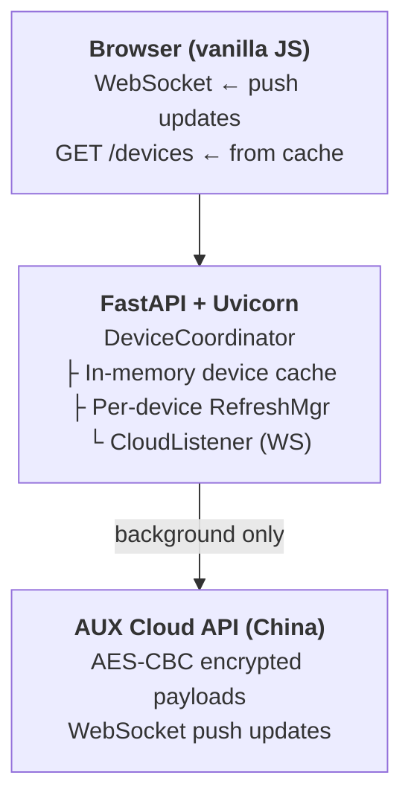
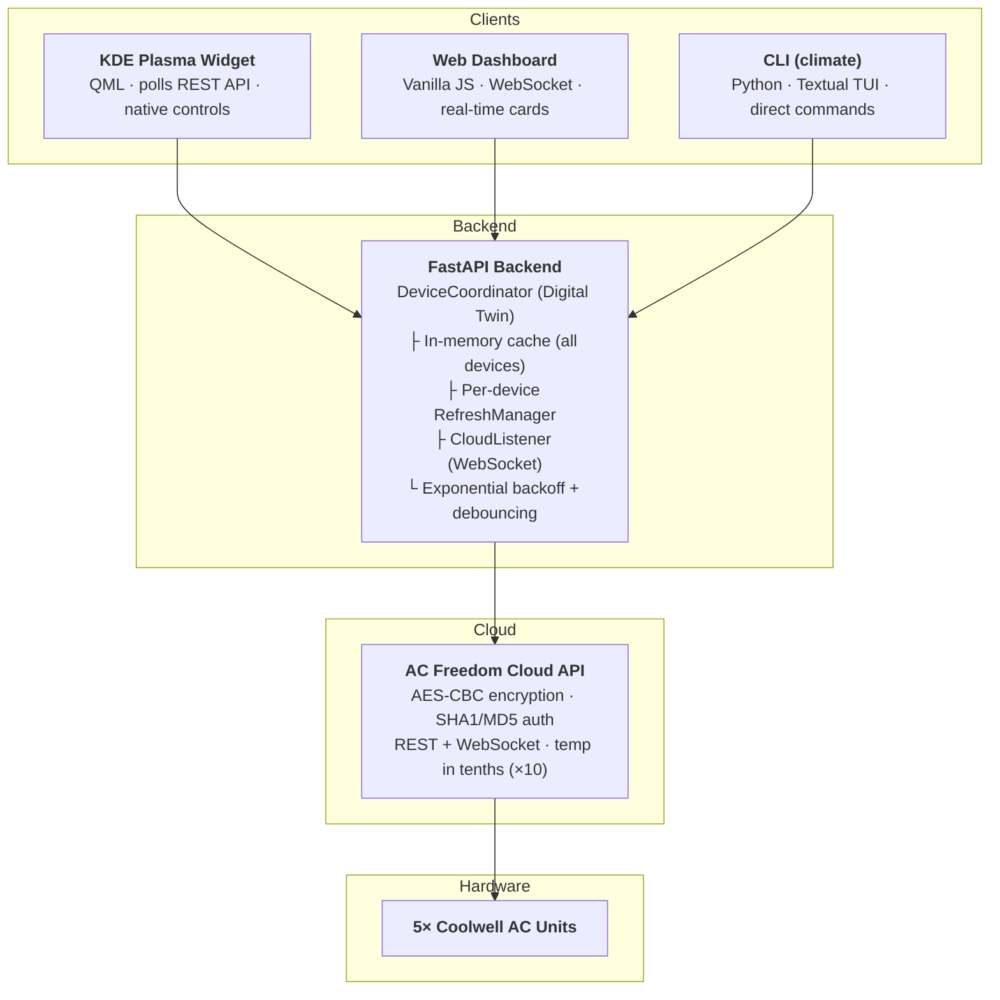

## How I Built a Control Hub for My AC Units — From Cloud API to KDE Widget

*Starting from an existing reverse-engineered client, I built a CLI, a web dashboard, and a KDE Plasma widget to control five AC units from anywhere in my home.*

> This article is a detour from the usual software topics — it's about home automation, building on open-source work, and layering interfaces on top of a proprietary cloud API. If you've ever looked at a mobile app and thought "I want this in my terminal," read on.

---

### The Starting Point

I have five Coolwell AC units at home, controllable through a mobile app called AcFreedom. The app talks to a cloud API in China, which relays commands to the units. It works, but I wanted more: terminal control, a web dashboard, and eventually a KDE Plasma widget on my desktop panel.

A quick search turned up a few existing projects: a Swift client ([makleso6/ACFreedom](https://github.com/makleso6/ACFreedom)), an ESPHome integration, and some Broadlink-based tools. The protocol was partially documented — AES-CBC encrypted payloads, SHA1 + MD5 auth token chains, JSON over HTTPS. Enough to build on.

---

### The Python Client and CLI

I started from the existing reverse-engineered code and built a proper Python client around it. Poetry, Python 3.12, type hints, ruff, mypy strict. The architecture has four layers: `api` (cloud communication, AES encryption, token management), `acfreedom` (business logic), `cli`, and `webapp`.

Within a couple of hours I had a working CLI:

```bash
$ ./coolwell list
00000000000000000000ec0bae3f027c  ON  22.0°C  "living room"
00000000000000000000ec0bae5d809c  ON  24.0°C  "bedroom"
00000000000000000000ec0bae6cf983  ON  21.0°C  "office"
...
```

Five AC units, visible from the terminal. Mode changes, fan speed, swing — all working. Along the way I hit a few quirks worth mentioning:

- **Float timestamps in login**: the API rejects integer timestamps. The original code sent `1767024039.374`; my refactored version truncated to `1767024039`. The API returned `{"error": -1005, "msg": "数据错误"}` ("data error"). Fix: keep the float.
- **Temperatures in tenths**: the API expects 22°C as the integer `220`, not `22`. Every other command worked fine — mode, fan speed, swing — but temperature always returned "server busy." The mobile app had been sending `220` all along. Fix: `temperature * 10`.

Neither of these is documented anywhere. The only way to find them was comparing raw payloads between the mobile app and my client.

---

### The Web Dashboard

Next step: a web dashboard so I could control the AC units from any browser. FastAPI backend, vanilla JavaScript frontend, WebSocket for real-time updates.

The first version had a problem: every time the frontend loaded the device list, it triggered a cascade of API calls to the Chinese cloud — families, devices, state, params for each unit. That's roughly **2,880 API calls per hour** for a single browser tab. The cloud started throttling, and the UI showed blank cards.

The solution was to decouple the frontend completely from the cloud. I implemented what I call the **Digital Twin** pattern:



The rules are simple:

1. **The frontend never triggers cloud API calls.** It reads exclusively from the in-memory cache.
2. **Background RefreshManagers** poll the cloud on their own schedule — one per device, with exponential backoff on errors (5s → 60s).
3. **The webapp doesn't serve requests until all RefreshManagers complete their first cycle.** No blank cards on load.
4. **WebSocket pushes from the cloud update the cache directly.** The frontend gets notified via its own WebSocket.

| Metric | Before | After |
|--------|--------|-------|
| API calls/hour | 2,880 | 60 |
| Response latency | 3.5s | <50ms |
| UI blank cards | Frequent | Never |

---

### The KDE Plasma Widget

With the backend serving fast cached responses, adding a native desktop widget was straightforward. The widget is a Plasma 6 plasmoid written in QML — five files:

- `main.qml` — data layer: polling timer, XHR calls to the Climate Hub REST API, control functions
- `CompactRepresentation.qml` — panel icon with a badge showing how many units are on
- `FullRepresentation.qml` — a grid popup showing all devices
- `DeviceDelegate.qml` — per-device card: power toggle, temperature slider (16–30°C), mode and fan speed dropdowns
- `configGeneral.qml` — settings for API URL and refresh interval

The compact view is minimal — a sun icon and a number:

```qml
RowLayout {
    Kirigami.Icon { source: "weather-clear" }
    PlasmaComponents.Label {
        text: compactRoot.activeCount > 0 ? compactRoot.activeCount : ""
        visible: compactRoot.activeCount > 0
        font.bold: true
    }
}
```

Click it, and a 380×400 popup shows all five units. Green border = on, grey = off, red = offline. The temperature slider sends commands only on release to avoid flooding the API:

```qml
QQC2.Slider {
    id: tempSlider
    from: 16; to: 30; stepSize: 0.5
    value: deviceData.targetTemperature
    onPressedChanged: {
        if (!pressed) {
            delegateRoot.setTemperature(deviceData.endpointId, value)
        }
    }
}
```

Since the backend handles the `× 10` conversion, the widget just sends `22.0` and the API gets `220`.

---

### Working with Multiple AIs

I used three AIs during this project, each with different strengths.

**Claude Code** handled the bulk: the Python client, the clean architecture, the debugging, the Digital Twin refactor. **Google Gemini** contributed the initial WebSocket implementation for real-time cloud updates — though Claude later found issues in Gemini's code (a `Content-Type` header that caused 403 errors on the WebSocket handshake). **Gemini CLI** helped build the KDE widget, where broad knowledge of Qt/KDE APIs was useful.

The pattern that worked well: each AI reviewed the other's commits. I held the architecture and made the decisions. The AIs provided speed and breadth.

Worth noting what the AIs didn't do: the "temperature in tenths" insight was mine. The Digital Twin architecture was my design — the AIs kept creating code paths where the frontend triggered cloud calls, despite being told not to. Domain-specific quirks (Chinese error messages, non-standard auth chains) required reading raw traffic.

---

### The Final Stack



Three interfaces (CLI, web, KDE widget), one backend, one cloud API. The backend is the single point of contact with the cloud — everything else reads from cache.

The project is open source: [github.com/gnespolino/climate-hub](https://github.com/gnespolino/climate-hub)

---

### Takeaways

- **Build on existing work.** I didn't reverse-engineer the protocol from scratch — I found partial implementations and built a proper system around them. Time well saved.
- **Cache everything, poll nothing.** If your frontend triggers API calls to a third-party cloud on every render, you will be rate-limited. Maintain a local replica, update it in the background.
- **Consumer IoT APIs are undocumented and inconsistent.** Temperatures in tenths, Chinese error messages, timestamps that must be floats. Read the raw traffic.
- **Multi-AI development works.** Each AI has different strengths. Let them review each other's code. Keep a human in the architecture seat.
- **Clean architecture pays off fast.** When you're debugging at 4 AM, you want the code to be readable. Poetry + type hints + strict linting from day one made the whole project manageable.
