```mermaid
graph LR
    subgraph "Composite Index (status, created_at)"
        A["status = 'PENDING'"] -->|"✅ Uses index"| I[Index Scan]
        B["status = 'PENDING'<br/>AND created_at > X"] -->|"✅ Uses index"| I
        C["created_at > X"] -->|"❌ Seq scan"| S[Full Table Scan]
    end

    style A fill:#1dd1a1,stroke:#333,color:#fff
    style B fill:#1dd1a1,stroke:#333,color:#fff
    style C fill:#ff6b6b,stroke:#333,color:#fff
```

## Database Patterns: PostgreSQL in Production

PostgreSQL is not just a database—it's a toolkit. Understanding its features can save you from adding Redis, Elasticsearch, or message queues prematurely. This article covers patterns I've used in production systems handling millions of records.

---

### 1. Connection Pooling: The Silent Killer

Each PostgreSQL connection consumes ~10MB of RAM and an OS process. Without pooling, a spike in traffic can exhaust connections and crash your database.

```mermaid
graph TB
    subgraph "Without Pooling"
        A1[Request 1] --> DB1[(PostgreSQL)]
        A2[Request 2] --> DB1
        A3[Request 3] --> DB1
        A4[Request N] --> DB1
        DB1 -->|"100+ connections<br/>= 1GB+ RAM"| BOOM[💥 OOM]
    end

    subgraph "With PgBouncer"
        B1[Request 1] --> PG[PgBouncer]
        B2[Request 2] --> PG
        B3[Request 3] --> PG
        B4[Request N] --> PG
        PG -->|"10 connections<br/>multiplexed"| DB2[(PostgreSQL)]
    end

    style BOOM fill:#ff6b6b,stroke:#333,color:#fff
    style PG fill:#1dd1a1,stroke:#333,color:#fff
```



**HikariCP Configuration (Spring Boot):**

```yaml
spring:
  datasource:
    hikari:
      maximum-pool-size: 10          # Start small!
      minimum-idle: 5
      connection-timeout: 30000      # 30 seconds
      idle-timeout: 600000           # 10 minutes
      max-lifetime: 1800000          # 30 minutes
      leak-detection-threshold: 2000 # Warn if connection held > 2s
```

**The Formula:**
```
connections = (core_count * 2) + effective_spindle_count
```

For most systems: **10-20 connections** is the sweet spot. More connections often means **worse** performance due to context switching.

> **War Story:** A team had 200 connections per service × 10 services = 2000 connections to a single Postgres instance. Queries that took 10ms started taking 500ms due to connection contention. We reduced it to 20 connections per service and performance improved 10x.

---

### 2. Indexing Strategies

**B-tree (Default): Most Common**
```sql
-- Good for equality and range queries
CREATE INDEX idx_users_email ON users(email);
CREATE INDEX idx_orders_created ON orders(created_at);

-- Query: WHERE email = 'x' or created_at > '2024-01-01'
```

**Partial Indexes: Only Index What You Query**
```sql
-- Only index active users (90% of queries hit this)
CREATE INDEX idx_users_active ON users(email) WHERE status = 'ACTIVE';

-- Only index unprocessed orders
CREATE INDEX idx_orders_pending ON orders(created_at) WHERE processed = false;
```

**GIN Indexes: For JSONB and Arrays**
```sql
-- Index JSON fields for fast lookups
CREATE INDEX idx_users_metadata ON users USING GIN (metadata);

-- Query: WHERE metadata @> '{"role": "admin"}'

-- Index array columns
CREATE INDEX idx_posts_tags ON posts USING GIN (tags);

-- Query: WHERE tags @> ARRAY['java', 'spring']
```

**Composite Indexes: Order Matters!**
```sql
-- Index on (status, created_at) is NOT the same as (created_at, status)
CREATE INDEX idx_orders_status_date ON orders(status, created_at);

-- ✅ Uses index: WHERE status = 'PENDING' AND created_at > '2024-01-01'
-- ✅ Uses index: WHERE status = 'PENDING'
-- ❌ Doesn't use index: WHERE created_at > '2024-01-01' (leftmost column missing)
```



---

### 3. JSONB: When to Use It

PostgreSQL's JSONB is powerful, but it's not a replacement for proper schema design.

**Good Use Cases:**
- Flexible metadata (user preferences, feature flags)
- External API responses (cache the raw JSON)
- Document storage for occasional queries

**Bad Use Cases:**
- Core business entities (use proper tables)
- Frequently queried/filtered fields (extract to columns)
- Data you need to JOIN on

```sql
-- Store flexible attributes
CREATE TABLE products (
    id BIGSERIAL PRIMARY KEY,
    name VARCHAR(255) NOT NULL,
    price NUMERIC(10,2) NOT NULL,
    attributes JSONB DEFAULT '{}'  -- Color, size, brand, etc.
);

-- Query JSON fields
SELECT * FROM products WHERE attributes->>'color' = 'red';
SELECT * FROM products WHERE attributes @> '{"size": "XL", "brand": "Nike"}';

-- Update nested JSON
UPDATE products
SET attributes = jsonb_set(attributes, '{stock}', '100')
WHERE id = 1;

-- Aggregate JSON
SELECT
    attributes->>'category' as category,
    COUNT(*),
    AVG(price)
FROM products
GROUP BY attributes->>'category';
```

**Index for Performance:**
```sql
-- Index specific paths you query often
CREATE INDEX idx_products_color ON products ((attributes->>'color'));

-- Or index everything (larger, but flexible)
CREATE INDEX idx_products_attrs ON products USING GIN (attributes);
```

---

### 4. Upsert Pattern (INSERT ... ON CONFLICT)

Handle "insert or update" atomically without race conditions:

```sql
-- Insert or update based on unique key
INSERT INTO user_settings (user_id, theme, notifications)
VALUES (123, 'dark', true)
ON CONFLICT (user_id)
DO UPDATE SET
    theme = EXCLUDED.theme,
    notifications = EXCLUDED.notifications,
    updated_at = NOW();

-- Insert only if not exists
INSERT INTO rate_limits (ip_address, requests)
VALUES ('192.168.1.1', 1)
ON CONFLICT (ip_address)
DO NOTHING;

-- Increment counter atomically
INSERT INTO page_views (page_id, views)
VALUES ('home', 1)
ON CONFLICT (page_id)
DO UPDATE SET views = page_views.views + EXCLUDED.views;
```

**Spring Data JPA:**
```java
@Modifying
@Query(value = """
    INSERT INTO user_settings (user_id, theme)
    VALUES (:userId, :theme)
    ON CONFLICT (user_id)
    DO UPDATE SET theme = :theme, updated_at = NOW()
    """, nativeQuery = true)
void upsertUserSettings(@Param("userId") Long userId, @Param("theme") String theme);
```

---

### 5. Advisory Locks: Distributed Locking Without Redis

PostgreSQL can act as a distributed lock manager:


```java
@Service
public class ScheduledJobService {
    private final JdbcTemplate jdbcTemplate;

    public void processWithLock(Long jobId) {
        // Try to acquire lock (non-blocking)
        Boolean acquired = jdbcTemplate.queryForObject(
            "SELECT pg_try_advisory_lock(?)",
            Boolean.class,
            jobId
        );

        if (!Boolean.TRUE.equals(acquired)) {
            log.info("Job {} already being processed by another instance", jobId);
            return;
        }

        try {
            // Only one instance executes this
            processJob(jobId);
        } finally {
            jdbcTemplate.execute("SELECT pg_advisory_unlock(" + jobId + ")");
        }
    }
}
```

**Use Cases:**
- Scheduled jobs in clustered environments
- Preventing duplicate processing
- Rate limiting per resource

---

### 6. LISTEN/NOTIFY: Pub/Sub Without Kafka

For simple use cases, PostgreSQL has built-in pub/sub:

```sql
-- Publisher (can be a trigger or application)
NOTIFY order_created, '{"order_id": "123", "amount": 99.99}';

-- Subscriber
LISTEN order_created;
```

**Spring Integration:**
```java
@Component
public class PostgresNotificationListener {

    @Autowired
    private DataSource dataSource;

    @PostConstruct
    public void startListening() {
        new Thread(() -> {
            try (Connection conn = dataSource.getConnection()) {
                conn.createStatement().execute("LISTEN order_created");

                PGConnection pgConn = conn.unwrap(PGConnection.class);

                while (true) {
                    PGNotification[] notifications = pgConn.getNotifications(10_000);
                    if (notifications != null) {
                        for (PGNotification n : notifications) {
                            handleNotification(n.getName(), n.getParameter());
                        }
                    }
                }
            } catch (SQLException e) {
                log.error("Notification listener failed", e);
            }
        }).start();
    }

    private void handleNotification(String channel, String payload) {
        log.info("Received on {}: {}", channel, payload);
        // Process the event
    }
}
```

**Trigger-Based Notifications:**
```sql
CREATE OR REPLACE FUNCTION notify_order_created()
RETURNS TRIGGER AS $$
BEGIN
    PERFORM pg_notify('order_created', row_to_json(NEW)::text);
    RETURN NEW;
END;
$$ LANGUAGE plpgsql;

CREATE TRIGGER order_created_trigger
AFTER INSERT ON orders
FOR EACH ROW EXECUTE FUNCTION notify_order_created();
```

> **When to use:** Simple event notifications within your system. For cross-service communication or guaranteed delivery, use Kafka.

---

### 7. Window Functions: Analytics Without ETL

```sql
-- Running total
SELECT
    order_date,
    amount,
    SUM(amount) OVER (ORDER BY order_date) as running_total
FROM orders;

-- Rank within category
SELECT
    product_name,
    category,
    sales,
    RANK() OVER (PARTITION BY category ORDER BY sales DESC) as category_rank
FROM products;

-- Compare to previous row
SELECT
    order_date,
    amount,
    amount - LAG(amount) OVER (ORDER BY order_date) as change_from_previous
FROM orders;

-- Moving average (last 7 days)
SELECT
    order_date,
    amount,
    AVG(amount) OVER (
        ORDER BY order_date
        ROWS BETWEEN 6 PRECEDING AND CURRENT ROW
    ) as moving_avg_7d
FROM orders;
```

---

### 8. Scaling PostgreSQL: Citus for Distributed Tables

For truly large datasets, Citus turns PostgreSQL into a distributed database:


```sql
-- Create distributed table
SELECT create_distributed_table('orders', 'customer_id');

-- Queries automatically route to correct shard
SELECT * FROM orders WHERE customer_id = 123;  -- Hits one shard

-- Aggregations parallelize across shards
SELECT customer_id, SUM(amount)
FROM orders
GROUP BY customer_id;  -- Each shard computes partial results
```

---

### Quick Reference

| Pattern | Use When | Alternative |
|---------|----------|-------------|
| **Connection Pooling** | Always | PgBouncer for production |
| **Partial Indexes** | Most queries filter on same condition | Full indexes (more storage) |
| **JSONB** | Flexible/sparse attributes | Normalize if queried heavily |
| **Upsert** | Insert-or-update logic | SELECT then INSERT/UPDATE (race conditions) |
| **Advisory Locks** | Simple distributed locking | Redis, Zookeeper |
| **LISTEN/NOTIFY** | Simple pub/sub within system | Kafka, RabbitMQ |
| **Citus** | Horizontal scaling (TB+ data) | Read replicas, sharding |

---

[Prev: Event-Driven Architecture](./Event_Driven_Architecture.md) | [Back to Index](../../README.md) | [Next: API Design](./API_Design.md)


---
## License
This repository is open-source under the [MIT License](/LICENSE.md).
