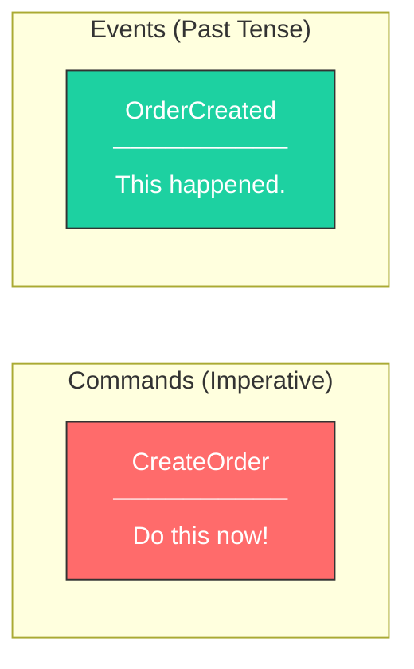
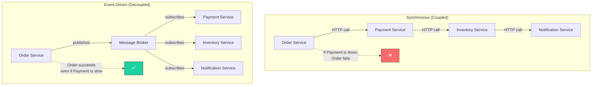
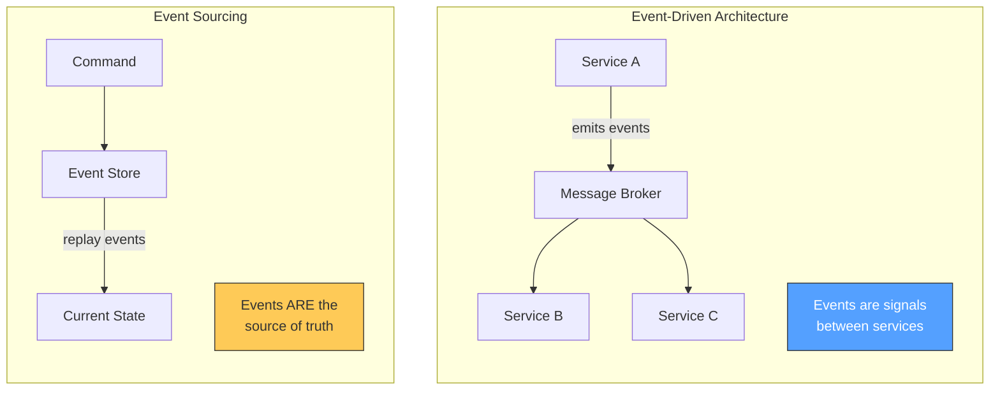
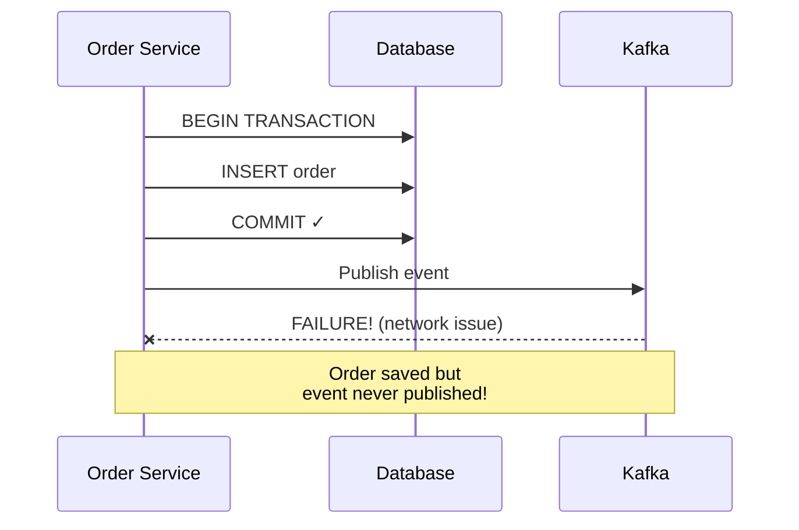
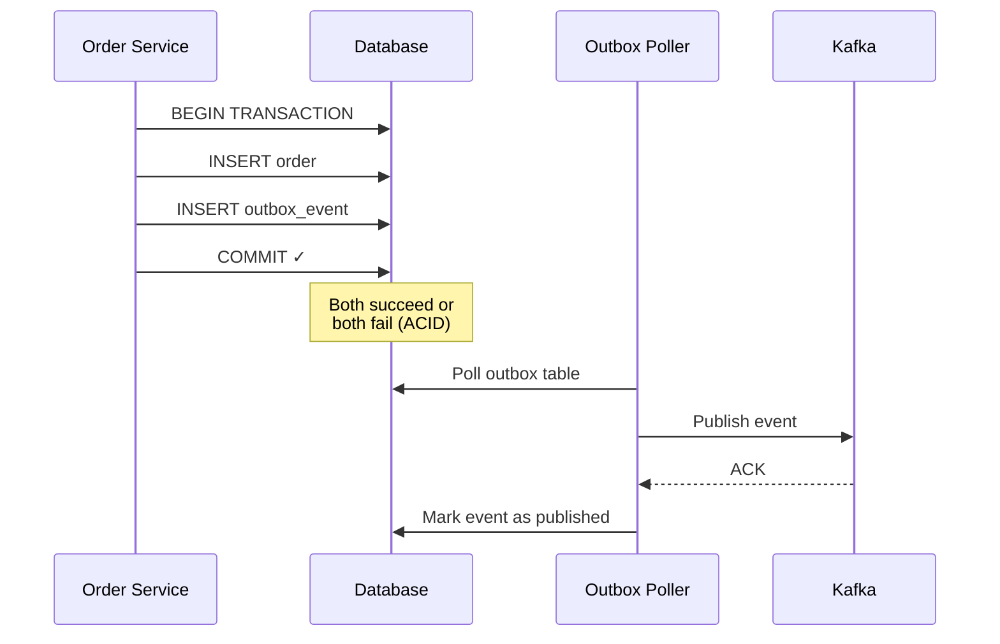

## Event-Driven Architecture: Decoupling Done Right

Event-Driven Architecture (EDA) is a design pattern where components communicate through events rather than direct calls. It's the backbone of scalable, loosely coupled systems—but it comes with trade-offs you must understand.

---

### 1. What is an Event?

An event is an **immutable fact** that something happened. It's not a command ("do this") or a request ("give me that")—it's a statement of truth about the past.



| Type | Example | Intent |
|------|---------|--------|
| **Command** | `CreateOrder` | "I want you to do this" |
| **Query** | `GetOrderById` | "Give me this data" |
| **Event** | `OrderCreated` | "This thing happened" |

```java
// Event: Immutable fact about the past
public record OrderCreated(
    String orderId,
    String customerId,
    List<LineItem> items,
    BigDecimal totalAmount,
    Instant occurredAt
) {}

// Command: Request to do something
public record CreateOrderCommand(
    String customerId,
    List<LineItem> items
) {}
```

---

### 2. Why Event-Driven?



**Benefits:**
- **Loose Coupling:** Producer doesn't know (or care) who consumes the event
- **Scalability:** Add new consumers without modifying the producer
- **Resilience:** If a consumer is down, events queue up and are processed later
- **Audit Trail:** Events are a natural audit log of everything that happened

**Trade-offs:**
- **Eventual Consistency:** Data won't be immediately consistent across services
- **Debugging Complexity:** Tracing a request across async boundaries is harder
- **Message Ordering:** Events may arrive out of order (you must handle this)

---

### 3. Event Sourcing vs Event-Driven

These are often confused. They're different patterns:



| Aspect | Event-Driven | Event Sourcing |
|--------|--------------|----------------|
| **Events are** | Communication signals | The source of truth |
| **State stored in** | Database (traditional) | Event log only |
| **Can rebuild state?** | No | Yes, by replaying events |
| **Complexity** | Moderate | High |

> **My Take:** Use Event-Driven Architecture liberally. Use Event Sourcing only when you have a specific need for audit trails or time-travel debugging (financial systems, compliance).

---

### 4. Implementation with Spring Boot + Kafka

**Producer: Publishing Events**

```java
@Service
@RequiredArgsConstructor
public class OrderService {
    private final KafkaTemplate<String, OrderEvent> kafkaTemplate;
    private final OrderRepository repository;

    @Transactional
    public Order createOrder(CreateOrderCommand command) {
        // 1. Create and save the order
        Order order = Order.create(command);
        repository.save(order);

        // 2. Publish the event
        OrderCreated event = new OrderCreated(
            order.getId(),
            order.getCustomerId(),
            order.getItems(),
            order.getTotal(),
            Instant.now()
        );

        kafkaTemplate.send("orders.created", order.getId(), event);

        return order;
    }
}
```

**Consumer: Reacting to Events**

```java
@Service
@RequiredArgsConstructor
public class InventoryEventHandler {
    private final InventoryService inventoryService;

    @KafkaListener(topics = "orders.created", groupId = "inventory-service")
    public void handleOrderCreated(OrderCreated event) {
        // Reserve inventory for each item
        event.items().forEach(item ->
            inventoryService.reserve(item.productId(), item.quantity())
        );
    }
}

@Service
@RequiredArgsConstructor
public class NotificationEventHandler {
    private final EmailService emailService;

    @KafkaListener(topics = "orders.created", groupId = "notification-service")
    public void handleOrderCreated(OrderCreated event) {
        // Send confirmation email
        emailService.sendOrderConfirmation(event.customerId(), event.orderId());
    }
}
```

**Configuration:**

```java
@Configuration
public class KafkaConfig {

    @Bean
    public ProducerFactory<String, OrderEvent> producerFactory() {
        Map<String, Object> config = new HashMap<>();
        config.put(ProducerConfig.BOOTSTRAP_SERVERS_CONFIG, "localhost:9092");
        config.put(ProducerConfig.KEY_SERIALIZER_CLASS_CONFIG, StringSerializer.class);
        config.put(ProducerConfig.VALUE_SERIALIZER_CLASS_CONFIG, JsonSerializer.class);
        // Idempotent producer for exactly-once semantics
        config.put(ProducerConfig.ENABLE_IDEMPOTENCE_CONFIG, true);
        return new DefaultKafkaProducerFactory<>(config);
    }

    @Bean
    public KafkaTemplate<String, OrderEvent> kafkaTemplate() {
        return new KafkaTemplate<>(producerFactory());
    }
}
```

---

### 5. The Outbox Pattern: Reliable Event Publishing

**The Problem:** What if your database transaction commits but Kafka publishing fails?



**The Solution: Outbox Pattern**



**Implementation:**

```java
// Outbox entity
@Entity
@Table(name = "outbox_events")
public class OutboxEvent {
    @Id
    private String id;
    private String aggregateType;  // "Order"
    private String aggregateId;    // order ID
    private String eventType;      // "OrderCreated"
    private String payload;        // JSON
    private Instant createdAt;
    private boolean published;
}

// Service saves both in same transaction
@Transactional
public Order createOrder(CreateOrderCommand command) {
    Order order = Order.create(command);
    repository.save(order);

    // Save event to outbox (same transaction!)
    OutboxEvent outboxEvent = new OutboxEvent(
        UUID.randomUUID().toString(),
        "Order",
        order.getId(),
        "OrderCreated",
        objectMapper.writeValueAsString(new OrderCreated(...)),
        Instant.now(),
        false
    );
    outboxRepository.save(outboxEvent);

    return order;
}

// Separate process polls and publishes
@Scheduled(fixedDelay = 1000)
@Transactional
public void publishOutboxEvents() {
    List<OutboxEvent> events = outboxRepository.findByPublishedFalse();

    for (OutboxEvent event : events) {
        kafkaTemplate.send(event.getAggregateType().toLowerCase() + ".events",
            event.getAggregateId(),
            event.getPayload()
        );
        event.setPublished(true);
    }
}
```

> **Pro Tip:** Use Debezium for Change Data Capture (CDC) instead of polling. It reads the database transaction log and is more efficient.

---

### 6. Handling Failures: Dead Letter Queues

What happens when a consumer can't process an event?


```java
@Configuration
public class KafkaConsumerConfig {

    @Bean
    public ConcurrentKafkaListenerContainerFactory<String, OrderEvent>
            kafkaListenerContainerFactory() {

        ConcurrentKafkaListenerContainerFactory<String, OrderEvent> factory =
            new ConcurrentKafkaListenerContainerFactory<>();

        factory.setConsumerFactory(consumerFactory());

        // Retry 3 times with backoff, then send to DLQ
        factory.setCommonErrorHandler(new DefaultErrorHandler(
            new DeadLetterPublishingRecoverer(kafkaTemplate),
            new FixedBackOff(1000L, 3)  // 1 second, 3 attempts
        ));

        return factory;
    }
}
```

---

### 7. Event Schema Evolution

Events are contracts. Changing them carelessly breaks consumers.

**Safe Changes:**
- Adding optional fields (with defaults)
- Adding new event types

**Breaking Changes:**
- Removing fields
- Renaming fields
- Changing field types

**Strategy: Schema Registry**

```java
// Version 1
public record OrderCreatedV1(String orderId, String customerId) {}

// Version 2 - Added field (backward compatible)
public record OrderCreatedV2(
    String orderId,
    String customerId,
    BigDecimal totalAmount  // New field with default
) {
    public OrderCreatedV2(String orderId, String customerId) {
        this(orderId, customerId, BigDecimal.ZERO);
    }
}
```

Use **Apache Avro** or **Protobuf** with a Schema Registry for production systems.

---

### Quick Reference

| Pattern | Use When |
|---------|----------|
| **Simple Events** | Services need to react to changes without tight coupling |
| **Outbox Pattern** | You need guaranteed event delivery |
| **Event Sourcing** | Full audit trail and state rebuild required |
| **Saga (Choreography)** | Distributed transactions with events as coordination |
| **Dead Letter Queue** | Handling unprocessable events gracefully |

---

[Prev: CI/CD Pipeline](./CI_CD_Pipeline.md) | [Back to Index](../../README.md) | [Next: Database Patterns](./Database_Patterns.md)


---
## License
This repository is open-source under the [MIT License](/LICENSE.md).
