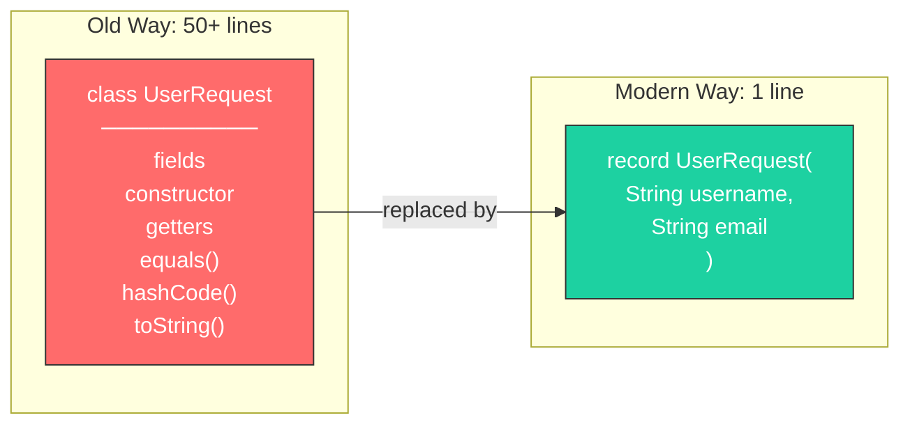
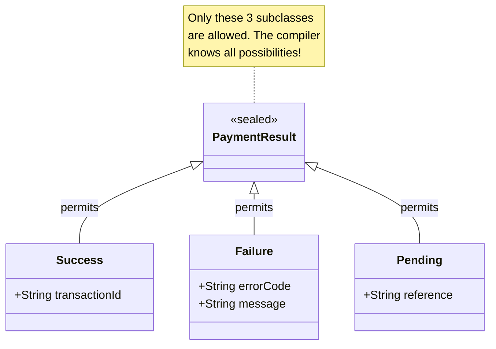
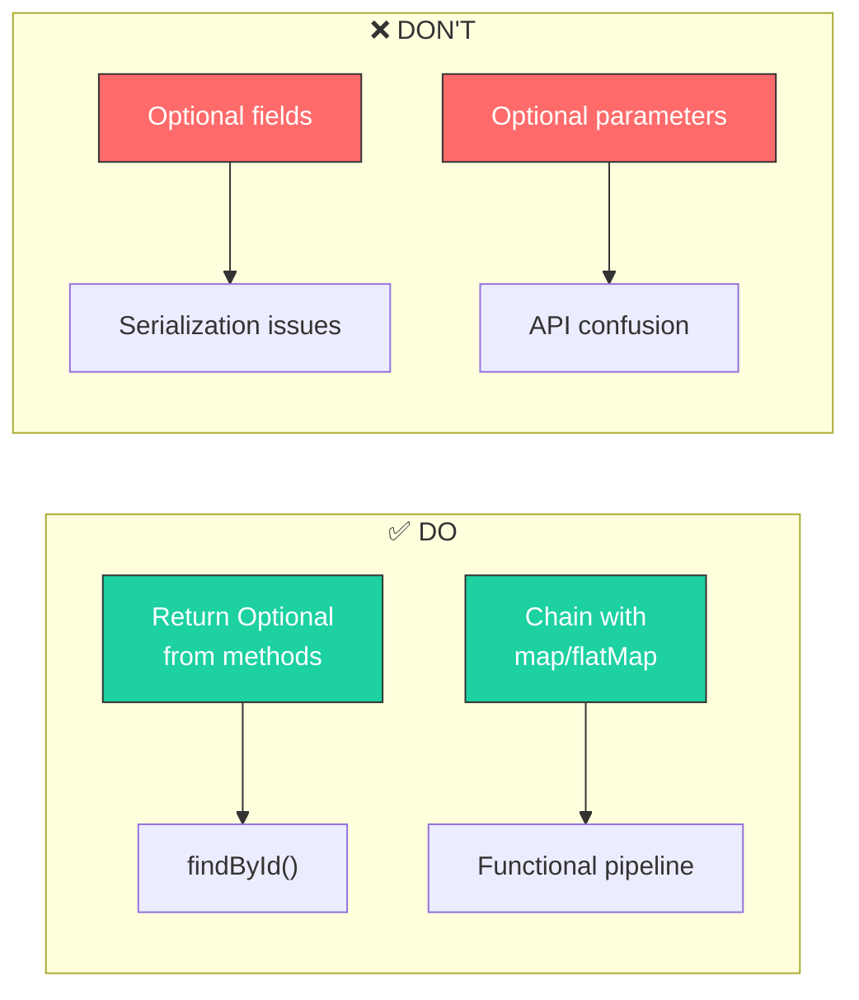
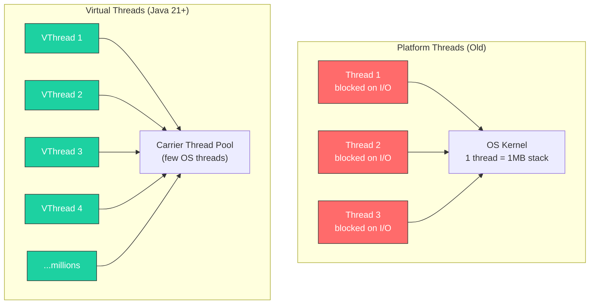

## Java Beyond the Basics: Modern Practices

Java has evolved significantly. If you are still writing code like it's Java 8 (or worse, Java 5), you are missing out on features that make code safer, more concise, and easier to read.

---

### 1. Embrace Immutability with Records (Java 14+)

For years, we relied on Lombok's `@Data` or wrote boilerplate `getters`, `hashCode`, and `equals`. Java Records solve this natively. They are immutable data carriers.



**Old Way (Lombok or Verbose):**
```java
public class UserRequest {
    private final String username;
    private final String email;

    public UserRequest(String username, String email) {
        this.username = username;
        this.email = email;
    }
    // + Getters, equals, hashCode, toString...
}
```

**Modern Way:**
```java
public record UserRequest(String username, String email) {
    // Validation can go in the compact constructor
    public UserRequest {
        Objects.requireNonNull(username, "username cannot be null");
        if (email == null || !email.contains("@")) {
            throw new IllegalArgumentException("Invalid email");
        }
    }
}
```

**Records in Spring Boot:**
```java
// Perfect for DTOs and API responses
public record ApiResponse<T>(T data, String message, Instant timestamp) {
    public ApiResponse(T data) {
        this(data, "Success", Instant.now());
    }
}

// Works with Jackson out of the box
@GetMapping("/users/{id}")
public ApiResponse<UserDto> getUser(@PathVariable Long id) {
    return new ApiResponse<>(userService.findById(id));
}
```

> **When to use Records:** DTOs, API requests/responses, value objects, configuration holders. NOT for entities with mutable state or JPA entities (they need a no-args constructor).

---

### 2. Sealed Classes: Controlled Inheritance (Java 17+)

Sealed classes restrict which classes can extend them. This gives you exhaustive pattern matching and documents your domain model explicitly.



```java
// Define a sealed hierarchy
public sealed interface PaymentResult permits Success, Failure, Pending {
}

public record Success(String transactionId, BigDecimal amount) implements PaymentResult {}
public record Failure(String errorCode, String message) implements PaymentResult {}
public record Pending(String reference, Instant expectedCompletion) implements PaymentResult {}

// The compiler knows all possible subtypes!
public String describeResult(PaymentResult result) {
    return switch (result) {
        case Success s -> "Payment completed: " + s.transactionId();
        case Failure f -> "Payment failed: " + f.message();
        case Pending p -> "Payment pending, ref: " + p.reference();
        // No default needed - compiler knows this is exhaustive!
    };
}
```

**Real-World Use Case: Domain Events**
```java
public sealed interface OrderEvent permits
        OrderCreated, OrderPaid, OrderShipped, OrderCancelled {

    Instant occurredAt();
    String orderId();
}

public record OrderCreated(String orderId, String customerId, Instant occurredAt)
    implements OrderEvent {}

public record OrderPaid(String orderId, BigDecimal amount, Instant occurredAt)
    implements OrderEvent {}

public record OrderShipped(String orderId, String trackingNumber, Instant occurredAt)
    implements OrderEvent {}

public record OrderCancelled(String orderId, String reason, Instant occurredAt)
    implements OrderEvent {}
```

---

### 3. Pattern Matching: The End of Casting (Java 16+)

**Pattern Matching for instanceof:**
```java
// OLD: Cast after instanceof check
if (obj instanceof String) {
    String s = (String) obj;  // Redundant cast
    System.out.println(s.length());
}

// MODERN: Pattern variable
if (obj instanceof String s) {
    System.out.println(s.length());  // 's' is already a String
}

// Even better with negation
if (!(obj instanceof String s)) {
    return;  // Early exit
}
// 's' is in scope here!
System.out.println(s.toUpperCase());
```

**Pattern Matching for switch (Java 21+):**
```java
public String formatValue(Object obj) {
    return switch (obj) {
        case null -> "null";
        case Integer i -> "int: " + i;
        case Long l -> "long: " + l;
        case Double d -> "double: %.2f".formatted(d);
        case String s when s.isEmpty() -> "empty string";
        case String s -> "string: " + s;
        case List<?> list when list.isEmpty() -> "empty list";
        case List<?> list -> "list with " + list.size() + " elements";
        default -> "unknown: " + obj.getClass().getSimpleName();
    };
}
```

**Guarded Patterns:**
```java
public BigDecimal calculateDiscount(Customer customer) {
    return switch (customer) {
        case Customer c when c.isVip() && c.yearsActive() > 5 ->
            new BigDecimal("0.30");  // 30% for loyal VIPs
        case Customer c when c.isVip() ->
            new BigDecimal("0.20");  // 20% for VIPs
        case Customer c when c.yearsActive() > 3 ->
            new BigDecimal("0.10");  // 10% for loyal customers
        default -> BigDecimal.ZERO;
    };
}
```

---

### 4. Switch Expressions (Java 14+)

The old `switch` statement was error-prone (missing `break` statements). The new switch expression is exhaustive and returns a value.

```java
// OLD: Statement with fall-through bugs
String type;
switch (status) {
    case PENDING:
        type = "Waiting";
        break;  // Forget this and you have a bug!
    case APPROVED:
    case VERIFIED:
        type = "Done";
        break;
    default:
        type = "Unknown";
}

// MODERN: Expression (no fall-through possible)
var type = switch (status) {
    case PENDING -> "Waiting";
    case APPROVED, VERIFIED -> "Done";
    case REJECTED -> "Failed";
    // No default needed if enum is exhaustive
};
```

**Multi-line blocks with yield:**
```java
var message = switch (httpStatus) {
    case 200, 201 -> "Success";
    case 400 -> {
        logger.warn("Bad request received");
        yield "Client error";
    }
    case 500 -> {
        logger.error("Server error!");
        alertOps();
        yield "Server error - ops notified";
    }
    default -> "Unknown status: " + httpStatus;
};
```

---

### 5. Better Null Handling: `Optional` Done Right

`Optional<T>` is a great return type for methods that might not return a value. It forces the caller to handle the absence of data.



**Do:**
```java
public Optional<User> findByEmail(String email) {
    return Optional.ofNullable(userRepository.findByEmail(email));
}

// Elegant chaining
String userName = userService.findByEmail(email)
    .map(User::getName)
    .orElse("Anonymous");

// With default supplier (lazy)
User user = userService.findById(id)
    .orElseGet(() -> userService.createGuest());

// Throw with custom exception
User user = userService.findById(id)
    .orElseThrow(() -> new UserNotFoundException(id));
```

**Don't:**
```java
// BAD: Optional as parameter
public void process(@NotNull Optional<User> user) { ... }

// BAD: Optional as field
public class Order {
    private Optional<Discount> discount;  // Don't do this
}

// BAD: Optional.get() without check
Optional<User> user = findUser();
user.get();  // NoSuchElementException waiting to happen
```

---

### 6. Virtual Threads: Scalability Without Complexity (Java 21+)

Virtual threads let you write blocking code that scales like async code.



```java
// Create millions of virtual threads without exhausting memory
try (var executor = Executors.newVirtualThreadPerTaskExecutor()) {
    IntStream.range(0, 100_000).forEach(i -> {
        executor.submit(() -> {
            // Each task gets its own virtual thread
            Thread.sleep(Duration.ofSeconds(1));
            return fetchDataFromApi(i);
        });
    });
}

// Spring Boot 3.2+ with virtual threads
@Bean
public TomcatProtocolHandlerCustomizer<?> protocolHandlerVirtualThreadExecutorCustomizer() {
    return protocolHandler -> {
        protocolHandler.setExecutor(Executors.newVirtualThreadPerTaskExecutor());
    };
}
```

> **When to use Virtual Threads:** I/O-bound workloads (HTTP calls, database queries). NOT for CPU-bound computations (use parallel streams or ForkJoinPool instead).

---

### 7. Avoid "Exception Driven Logic"

Exceptions are expensive (stack trace generation) and disrupt control flow. Don't use them for expected business outcomes.

**Bad Practice:**
```java
try {
    userService.login(user);
} catch (UserNotFoundException e) {
    registerUser(user);  // Using exception for control flow
}
```

**Better Practice (Result Pattern):**
```java
// Using sealed classes for explicit outcomes
public sealed interface LoginResult permits
    LoginSuccess, UserNotFound, InvalidPassword {
}

public record LoginSuccess(User user, String token) implements LoginResult {}
public record UserNotFound(String email) implements LoginResult {}
public record InvalidPassword(int attemptsRemaining) implements LoginResult {}

// Clean handling
var result = authService.login(email, password);
return switch (result) {
    case LoginSuccess s -> ResponseEntity.ok(s.token());
    case UserNotFound n -> ResponseEntity.status(404).body("User not found");
    case InvalidPassword p -> ResponseEntity.status(401)
        .body("Invalid password. " + p.attemptsRemaining() + " attempts remaining");
};
```

---

### Quick Reference: Java Version Features

| Feature | Version | Use Case |
|---------|---------|----------|
| Records | 14+ | DTOs, value objects |
| Sealed Classes | 17+ | Domain modeling, type hierarchies |
| Pattern Matching (instanceof) | 16+ | Safe casting |
| Pattern Matching (switch) | 21+ | Complex type dispatch |
| Switch Expressions | 14+ | Replacing switch statements |
| Virtual Threads | 21+ | High-concurrency I/O |
| Text Blocks | 15+ | Multi-line strings (JSON, SQL) |

---

[Prev: 7 Tips from Linus Torvalds](./Linus_Torvalds_Tips.md) | [Back to Index](../../README.md) | [Next: The Truth About Microservices](./Microservices_Reality_Check.md)


---
## License
This repository is open-source under the [MIT License](/LICENSE.md).
