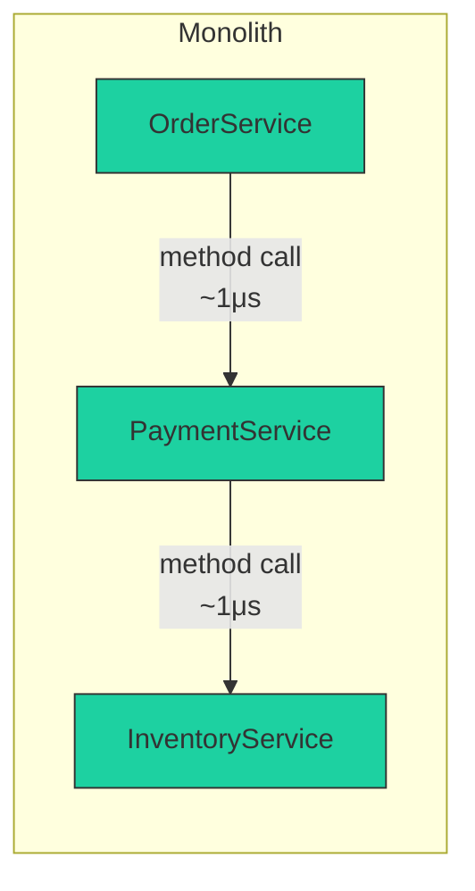
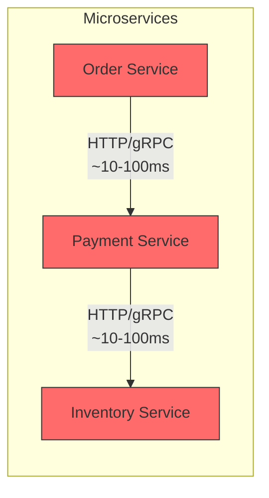
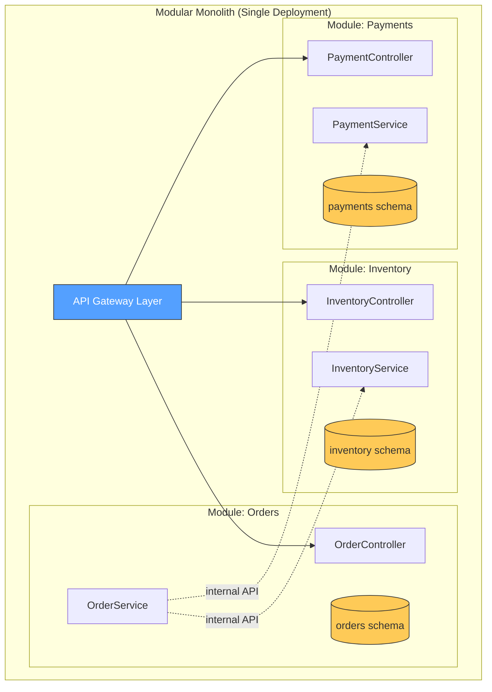
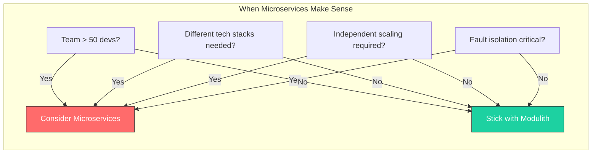
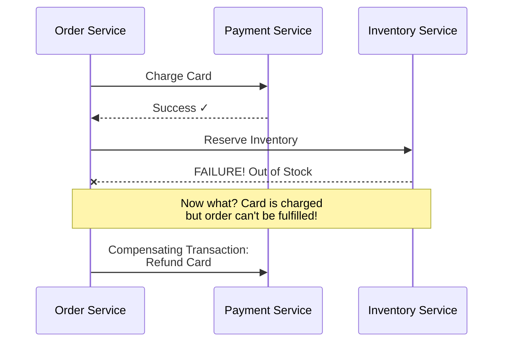
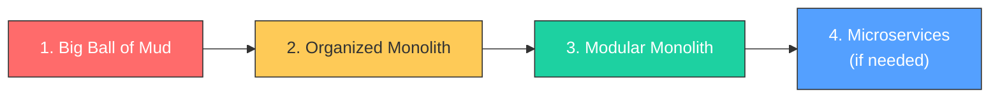

## The Truth About Microservices

Microservices have become the default answer to "how should we build this?" regardless of the question. While powerful, they come with a massive hidden tax: **complexity**.

---

### 1. Distributed Systems are Hard

In a Monolith, function calls are fast, reliable, and in-memory.
In Microservices, function calls become network requests. Network requests are:
*   Slow (latency).
*   Unreliable (timeouts, dropped packets).
*   Insecure (need encryption).





**Fallacy:** "Microservices make things simpler."
**Reality:** They replace code complexity with infrastructure complexity.

> **War Story:** I once saw a team split a monolith into 12 microservices. A single user registration that took 50ms in the monolith now took 800ms due to cascading HTTP calls. They spent 6 months adding caching, circuit breakers, and async messaging—just to get back to the performance they had before.

---

### 2. The Modular Monolith (Modulith)

Before splitting your app into 10 services, consider a Modular Monolith.



*   **Single Deployable Unit:** Easy to test, easy to deploy.
*   **Strict Boundaries:** Use packages/modules (Java 9+ Modules, Gradle subprojects) to enforce separation.
*   **Separate Databases (Logical):** Different modules can own different tables (schemas) within the same DB instance.

**Enforcing Module Boundaries in Java:**

```java
// module-info.java for the Orders module
module com.myapp.orders {
    requires com.myapp.common;

    exports com.myapp.orders.api;           // Public API
    // Internal packages are NOT exported—compile-time enforcement
}

// Or with ArchUnit for runtime checks
@ArchTest
static final ArchRule ordersModuleIsolation = noClasses()
    .that().resideInAPackage("..payments..")
    .should().accessClassesThat().resideInAPackage("..orders.internal..");
```

If your modules are tightly coupled in a monolith, splitting them into microservices will only create a **Distributed Monolith**—the worst of both worlds.

---

### 3. When to use Microservices?

Use them only when you have a specific problem that a monolith cannot solve:

| Problem | Microservices Solution |
|---------|----------------------|
| **Independent Scaling** | Video Processing needs 100 CPUs, User Profile needs 1 |
| **Organizational Scale** | 50+ developers stepping on each other's toes |
| **Polyglot Requirements** | Python for ML, Java for Backend, Go for high-concurrency |
| **Fault Isolation** | Payment failures shouldn't crash the entire app |



---

### 4. Data Consistency is the Boss

In a monolith, you have ACID transactions. `COMMIT` and it's done.

In microservices, you have **Eventual Consistency**.



This is called the **Saga Pattern**. Every action needs a compensating action.

**Saga Pattern Implementation:**

```java
public class OrderSaga {

    public void createOrder(OrderRequest request) {
        String sagaId = UUID.randomUUID().toString();

        try {
            // Step 1: Reserve inventory
            inventoryService.reserve(sagaId, request.getItems());

            // Step 2: Charge payment
            paymentService.charge(sagaId, request.getPaymentDetails());

            // Step 3: Create order
            orderService.create(sagaId, request);

        } catch (PaymentException e) {
            // Compensate: Release inventory
            inventoryService.release(sagaId);
            throw new OrderFailedException("Payment failed", e);

        } catch (OrderException e) {
            // Compensate: Refund payment AND release inventory
            paymentService.refund(sagaId);
            inventoryService.release(sagaId);
            throw new OrderFailedException("Order creation failed", e);
        }
    }
}
```

**Or with Spring State Machine for Complex Sagas:**

```java
@Configuration
@EnableStateMachineFactory
public class OrderSagaConfig extends StateMachineConfigurerAdapter<OrderState, OrderEvent> {

    @Override
    public void configure(StateMachineTransitionConfigurer<OrderState, OrderEvent> transitions)
            throws Exception {
        transitions
            .withExternal()
                .source(CREATED).target(INVENTORY_RESERVED)
                .event(RESERVE_INVENTORY)
                .action(reserveInventoryAction())
            .and()
            .withExternal()
                .source(INVENTORY_RESERVED).target(PAYMENT_PROCESSED)
                .event(PROCESS_PAYMENT)
                .action(processPaymentAction())
            .and()
            .withExternal()
                .source(PAYMENT_PROCESSED).target(COMPLETED)
                .event(COMPLETE_ORDER)
            .and()
            // Compensation transitions
            .withExternal()
                .source(INVENTORY_RESERVED).target(CANCELLED)
                .event(PAYMENT_FAILED)
                .action(releaseInventoryAction());  // Compensating action
    }
}
```

> **The Question:** Are you ready to write rollback logic for every business process? If not, stick to the Monolith.

---

### 5. Start Here: The Migration Path



1. **Organize** your code into logical packages
2. **Enforce boundaries** with ArchUnit or Java modules
3. **Separate schemas** in your database
4. **Extract services** only when you have a concrete scaling/team need

Don't start with microservices. Earn them.

---

[Prev: Java Modern Practices](./Java_Modern_Practices.md) | [Back to Index](../../README.md) | [Next: Testing Strategies](./Testing_Strategy.md)


---
## License
This repository is open-source under the [MIT License](/LICENSE.md).
