## Testing Strategies that Don't Suck

Testing is not about checking off a box for "Code Coverage". It's about **confidence**. Confidence to refactor, confidence to ship, and confidence that you haven't broken existing features.

---

### 1. The Testing Pyramid (Real World Edition)

```mermaid
graph TB
    subgraph pyramid[" "]
        E2E["🔺 E2E Tests (10%)<br/>Slow, Brittle, Critical Paths"]
        INT["🔶 Integration Tests (20%)<br/>Service + DB, API Contracts"]
        UNIT["🟩 Unit Tests (70%)<br/>Fast, Isolated, Cheap"]
    end

    E2E --> INT --> UNIT

    style E2E fill:#ff6b6b,stroke:#333,color:#fff
    style INT fill:#feca57,stroke:#333,color:#333
    style UNIT fill:#1dd1a1,stroke:#333,color:#fff
```



| Layer | Speed | What to Test | Tools |
|-------|-------|--------------|-------|
| **Unit** | ~ms | Business logic, algorithms, validators | JUnit, Mockito |
| **Integration** | ~seconds | DB queries, REST endpoints, messaging | Testcontainers, MockMvc |
| **E2E** | ~minutes | Critical user journeys | Selenium, Playwright |

> **War Story:** At a fintech company, we had 2000+ unit tests that ran in 30 seconds, but our E2E suite took 45 minutes. We cut E2E to only cover payment flows and login—the tests that would wake someone up at 3 AM if they failed. Everything else was covered by integration tests with Testcontainers.

---

### 2. Mockito: A Double-Edged Sword

Mocks are useful to isolate the Unit under test, but **over-mocking** leads to fragile tests that test implementation, not behavior.

**Bad Test (Testing the Implementation):**
```java
// If you change the internal implementation to use a different method, this test fails!
@Test
void badTest() {
    when(repository.findById(1L)).thenReturn(Optional.of(user));

    service.getUser(1L);

    verify(repository, times(1)).findById(any()); // Testing HOW, not WHAT
}
```

**Good Test (Testing the Behavior):**
```java
// This test survives refactoring—it only cares about the result
@Test
void goodTest() {
    when(repository.findById(1L)).thenReturn(Optional.of(new User("John")));

    User result = service.getUser(1L);

    assertEquals("John", result.getName()); // Testing WHAT, not HOW
}
```

> **Rule of Thumb:** If your test breaks when you refactor (without changing behavior), it's testing implementation details.

---

### 3. Testcontainers > In-Memory DBs

Don't use H2 for testing if you use PostgreSQL in production. They behave differently (syntax, locking, JSON operators, window functions).

**The Problem with H2:**
```java
// This works in H2 but fails in PostgreSQL
SELECT * FROM users WHERE data->>'name' = 'John';  // JSON operator

// H2 doesn't support PostgreSQL-specific features:
// - LISTEN/NOTIFY
// - Advisory locks
// - JSONB operators
// - Window functions behave differently
```

**The Solution: Testcontainers**

```java
@SpringBootTest
@Testcontainers
class UserRepositoryIntegrationTest {

    @Container
    static PostgreSQLContainer<?> postgres = new PostgreSQLContainer<>("postgres:15-alpine")
        .withDatabaseName("testdb")
        .withUsername("test")
        .withPassword("test");

    @DynamicPropertySource
    static void configureProperties(DynamicPropertyRegistry registry) {
        registry.add("spring.datasource.url", postgres::getJdbcUrl);
        registry.add("spring.datasource.username", postgres::getUsername);
        registry.add("spring.datasource.password", postgres::getPassword);
    }

    @Autowired
    private UserRepository userRepository;

    @Test
    void shouldSaveAndRetrieveUser() {
        // Given
        User user = new User("john@example.com", "John Doe");

        // When
        User saved = userRepository.save(user);
        Optional<User> found = userRepository.findByEmail("john@example.com");

        // Then
        assertThat(found).isPresent();
        assertThat(found.get().getName()).isEqualTo("John Doe");
    }

    @Test
    void shouldHandlePostgresSpecificFeatures() {
        // Test JSONB, arrays, or other Postgres-specific features
        // This would FAIL with H2!
    }
}
```

**Pro Tip: Reusable Container**
```java
// Singleton container for faster test suites
public abstract class AbstractIntegrationTest {

    static final PostgreSQLContainer<?> POSTGRES;

    static {
        POSTGRES = new PostgreSQLContainer<>("postgres:15-alpine")
            .withReuse(true); // Reuse across test runs
        POSTGRES.start();
    }

    @DynamicPropertySource
    static void configureProperties(DynamicPropertyRegistry registry) {
        registry.add("spring.datasource.url", POSTGRES::getJdbcUrl);
        registry.add("spring.datasource.username", POSTGRES::getUsername);
        registry.add("spring.datasource.password", POSTGRES::getPassword);
    }
}
```

---

### 4. TDD (Test Driven Development)

TDD is not about writing tests. It's about **designing APIs**.

```mermaid
graph LR
    R["🔴 RED<br/>Write failing test"] --> G["🟢 GREEN<br/>Make it pass"]
    G --> RF["🔵 REFACTOR<br/>Clean up"]
    RF --> R

    style R fill:#ff6b6b,stroke:#333,color:#fff
    style G fill:#1dd1a1,stroke:#333,color:#fff
    style RF fill:#54a0ff,stroke:#333,color:#fff
```



1. **Red:** Write a test that fails. (Forces you to think: "How do I want to call this method?")
2. **Green:** Write just enough code to pass. (Prevents over-engineering.)
3. **Refactor:** Clean it up. (Safe because you have the test.)

**Example: Building a Password Validator with TDD**

```java
// Step 1: RED - Write the test first
@Test
void passwordMustBeAtLeast8Characters() {
    PasswordValidator validator = new PasswordValidator();

    assertFalse(validator.isValid("short"));
    assertTrue(validator.isValid("longenough"));
}

// Step 2: GREEN - Minimal implementation
public class PasswordValidator {
    public boolean isValid(String password) {
        return password.length() >= 8;
    }
}

// Step 3: RED - Add another requirement
@Test
void passwordMustContainNumber() {
    PasswordValidator validator = new PasswordValidator();

    assertFalse(validator.isValid("nonumbers"));
    assertTrue(validator.isValid("has1number"));
}

// Step 4: GREEN - Extend implementation
public boolean isValid(String password) {
    return password.length() >= 8
        && password.matches(".*\\d.*");
}

// Step 5: REFACTOR - Clean up
public boolean isValid(String password) {
    return hasMinimumLength(password) && containsDigit(password);
}
```

> **The TDD Mindset:** If you write tests *after* the code, you often write tests that fit the implementation, rather than tests that verify the requirements.

---

### 5. What NOT to Test

Not everything needs a test. Focus your energy:

| Test This | Skip This |
|-----------|-----------|
| Business logic | Getters/Setters |
| Edge cases | Framework code (Spring, Hibernate) |
| Error handling | Third-party libraries |
| Complex algorithms | Simple delegation |

```java
// DON'T test this - it's just delegation
public User getUser(Long id) {
    return repository.findById(id).orElseThrow();
}

// DO test this - it has business logic
public boolean canUserAccessResource(User user, Resource resource) {
    return user.getRoles().stream()
        .anyMatch(role -> resource.getAllowedRoles().contains(role));
}
```

---

[Prev: The Truth About Microservices](./Microservices_Reality_Check.md) | [Back to Index](../../README.md) | [Next: Linux for Developers](./Linux_For_Developers.md)


---
## License
This repository is open-source under the [MIT License](/LICENSE.md).
